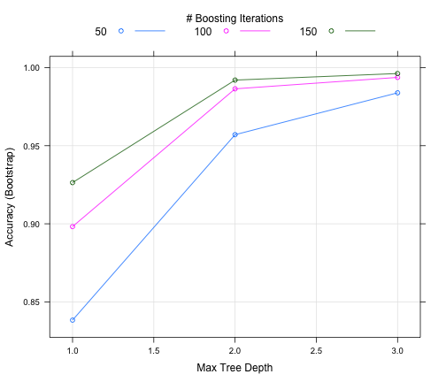
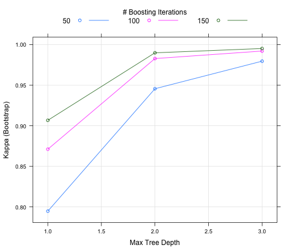
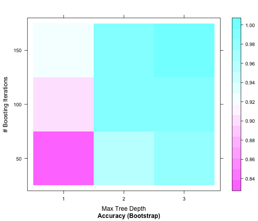
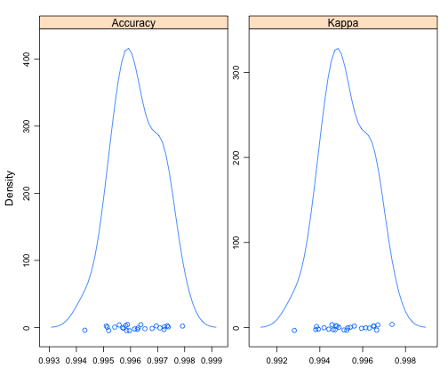

DH Min's Machine Learning Project : 2014 Dec 20
========================================================
## 0. Summary 
### This is a report describing how to build a human activity recoginition model with weight lifting exercise data provided by Groupware(http://groupware.les.inf.puc-rio.br/har) 
### The human activity recognition model which predicts/classify weight lift activities, is built using 'gbm'method. 

## 1. Data
### For details of the data, refer the Groupware url.   
### The training data and test data for this project are provided by instructor 
### https://d396qusza40orc.cloudfront.net/predmachlearn/pml-training.csv
### https://d396qusza40orc.cloudfront.net/predmachlearn/pml-testing.csv

## 2. Model building process
### Load necessary packages

```r
library(caret)
```

```
## Loading required package: lattice
## Loading required package: ggplot2
```

```r
library(AppliedPredictiveModeling)
```

### read training data file and test data file

```r
training <- read.csv("./pml-training.csv")
testing <- read.csv("./pml-testing.csv")
```

### delete meaningless columns,which filled with 'NA',from testing data.

```r
testing <- testing[, colSums(is.na(testing)) < nrow(testing)]
```

### delete training data columns which are not used in testing data. Keeping 'classe' column.

```r
training <- subset(training, select = -c(X))
testing <- subset(testing, select = -c(X))
selectedColnames <- colnames(testing)
selectedColnames <- c(selectedColnames, "classe")
training <- training[, which(names(training) %in% selectedColnames)]
```

### fitting a model with 'gbm'method. I chose 'gbm'method because it is a method that can be suitable for multi variable classification, well-known for being comparatively fast and accurate since it uses trees and boost for prediction.

```r
modelFit <- train(classe ~ ., data = training, method = "gbm")
```

```
## Loading required package: gbm
## Loading required package: survival
## Loading required package: splines
## 
## Attaching package: 'survival'
## 
## The following object is masked from 'package:caret':
## 
##     cluster
## 
## Loading required package: parallel
## Loaded gbm 2.1
## Loading required package: plyr
```

```
## Iter   TrainDeviance   ValidDeviance   StepSize   Improve
##      1        1.6094             nan     0.1000    0.1282
##      2        1.5231             nan     0.1000    0.0920
##      3        1.4629             nan     0.1000    0.0671
##      4        1.4182             nan     0.1000    0.0567
##      5        1.3812             nan     0.1000    0.0524
##      6        1.3476             nan     0.1000    0.0498
##      7        1.3164             nan     0.1000    0.0417
##      8        1.2893             nan     0.1000    0.0394
##      9        1.2630             nan     0.1000    0.0387
##     10        1.2396             nan     0.1000    0.0412
##     20        1.0597             nan     0.1000    0.0241
##     40        0.8405             nan     0.1000    0.0131
##     60        0.7078             nan     0.1000    0.0076
##     80        0.6052             nan     0.1000    0.0067
##    100        0.5261             nan     0.1000    0.0049
##    120        0.4610             nan     0.1000    0.0031
##    140        0.4115             nan     0.1000    0.0027
##    150        0.3897             nan     0.1000    0.0030
## 
## Iter   TrainDeviance   ValidDeviance   StepSize   Improve
##      1        1.6094             nan     0.1000    0.1906
##      2        1.4843             nan     0.1000    0.1503
##      3        1.3886             nan     0.1000    0.1084
##      4        1.3174             nan     0.1000    0.0898
##      5        1.2599             nan     0.1000    0.0866
##      6        1.2056             nan     0.1000    0.0971
##      7        1.1464             nan     0.1000    0.0759
##      8        1.1000             nan     0.1000    0.0572
##      9        1.0644             nan     0.1000    0.0571
##     10        1.0290             nan     0.1000    0.0560
##     20        0.7655             nan     0.1000    0.0340
##     40        0.4715             nan     0.1000    0.0153
##     60        0.3177             nan     0.1000    0.0091
##     80        0.2218             nan     0.1000    0.0045
##    100        0.1607             nan     0.1000    0.0042
##    120        0.1200             nan     0.1000    0.0022
##    140        0.0900             nan     0.1000    0.0020
##    150        0.0788             nan     0.1000    0.0011
## 
## Iter   TrainDeviance   ValidDeviance   StepSize   Improve
##      1        1.6094             nan     0.1000    0.2548
##      2        1.4478             nan     0.1000    0.1902
##      3        1.3276             nan     0.1000    0.1402
##      4        1.2384             nan     0.1000    0.1310
##      5        1.1561             nan     0.1000    0.1130
##      6        1.0864             nan     0.1000    0.0868
##      7        1.0309             nan     0.1000    0.0920
##      8        0.9746             nan     0.1000    0.0762
##      9        0.9274             nan     0.1000    0.0660
##     10        0.8861             nan     0.1000    0.0667
##     20        0.5761             nan     0.1000    0.0385
##     40        0.2954             nan     0.1000    0.0148
##     60        0.1625             nan     0.1000    0.0075
##     80        0.1004             nan     0.1000    0.0036
##    100        0.0656             nan     0.1000    0.0019
##    120        0.0452             nan     0.1000    0.0008
##    140        0.0335             nan     0.1000    0.0008
##    150        0.0290             nan     0.1000    0.0005
## 
## Iter   TrainDeviance   ValidDeviance   StepSize   Improve
##      1        1.6094             nan     0.1000    0.1273
##      2        1.5240             nan     0.1000    0.0899
##      3        1.4662             nan     0.1000    0.0654
##      4        1.4225             nan     0.1000    0.0554
##      5        1.3866             nan     0.1000    0.0514
##      6        1.3536             nan     0.1000    0.0471
##      7        1.3237             nan     0.1000    0.0468
##      8        1.2957             nan     0.1000    0.0350
##      9        1.2739             nan     0.1000    0.0439
##     10        1.2459             nan     0.1000    0.0348
##     20        1.0641             nan     0.1000    0.0205
##     40        0.8474             nan     0.1000    0.0135
##     60        0.7106             nan     0.1000    0.0085
##     80        0.6128             nan     0.1000    0.0067
##    100        0.5310             nan     0.1000    0.0065
##    120        0.4678             nan     0.1000    0.0039
##    140        0.4165             nan     0.1000    0.0031
##    150        0.3947             nan     0.1000    0.0021
## 
## Iter   TrainDeviance   ValidDeviance   StepSize   Improve
##      1        1.6094             nan     0.1000    0.1964
##      2        1.4840             nan     0.1000    0.1407
##      3        1.3930             nan     0.1000    0.1089
##      4        1.3231             nan     0.1000    0.0947
##      5        1.2621             nan     0.1000    0.0829
##      6        1.2088             nan     0.1000    0.0927
##      7        1.1523             nan     0.1000    0.0747
##      8        1.1067             nan     0.1000    0.0737
##      9        1.0621             nan     0.1000    0.0579
##     10        1.0265             nan     0.1000    0.0532
##     20        0.7656             nan     0.1000    0.0283
##     40        0.4786             nan     0.1000    0.0150
##     60        0.3255             nan     0.1000    0.0133
##     80        0.2233             nan     0.1000    0.0054
##    100        0.1614             nan     0.1000    0.0034
##    120        0.1204             nan     0.1000    0.0016
##    140        0.0910             nan     0.1000    0.0018
##    150        0.0801             nan     0.1000    0.0020
## 
## Iter   TrainDeviance   ValidDeviance   StepSize   Improve
##      1        1.6094             nan     0.1000    0.2510
##      2        1.4490             nan     0.1000    0.1828
##      3        1.3330             nan     0.1000    0.1492
##      4        1.2390             nan     0.1000    0.1262
##      5        1.1603             nan     0.1000    0.1002
##      6        1.0972             nan     0.1000    0.1003
##      7        1.0355             nan     0.1000    0.0944
##      8        0.9769             nan     0.1000    0.0779
##      9        0.9286             nan     0.1000    0.0751
##     10        0.8819             nan     0.1000    0.0676
##     20        0.5851             nan     0.1000    0.0368
##     40        0.2973             nan     0.1000    0.0169
##     60        0.1714             nan     0.1000    0.0066
##     80        0.1065             nan     0.1000    0.0036
##    100        0.0713             nan     0.1000    0.0027
##    120        0.0496             nan     0.1000    0.0016
##    140        0.0364             nan     0.1000    0.0010
##    150        0.0314             nan     0.1000    0.0005
## 
## Iter   TrainDeviance   ValidDeviance   StepSize   Improve
##      1        1.6094             nan     0.1000    0.1328
##      2        1.5215             nan     0.1000    0.0906
##      3        1.4612             nan     0.1000    0.0715
##      4        1.4148             nan     0.1000    0.0558
##      5        1.3780             nan     0.1000    0.0509
##      6        1.3453             nan     0.1000    0.0482
##      7        1.3155             nan     0.1000    0.0441
##      8        1.2875             nan     0.1000    0.0353
##      9        1.2648             nan     0.1000    0.0386
##     10        1.2396             nan     0.1000    0.0350
##     20        1.0577             nan     0.1000    0.0225
##     40        0.8414             nan     0.1000    0.0119
##     60        0.7054             nan     0.1000    0.0077
##     80        0.6046             nan     0.1000    0.0050
##    100        0.5254             nan     0.1000    0.0063
##    120        0.4626             nan     0.1000    0.0041
##    140        0.4115             nan     0.1000    0.0039
##    150        0.3873             nan     0.1000    0.0029
## 
## Iter   TrainDeviance   ValidDeviance   StepSize   Improve
##      1        1.6094             nan     0.1000    0.1943
##      2        1.4830             nan     0.1000    0.1473
##      3        1.3874             nan     0.1000    0.1113
##      4        1.3165             nan     0.1000    0.0936
##      5        1.2560             nan     0.1000    0.0806
##      6        1.2040             nan     0.1000    0.0876
##      7        1.1506             nan     0.1000    0.0676
##      8        1.1078             nan     0.1000    0.0625
##      9        1.0684             nan     0.1000    0.0632
##     10        1.0300             nan     0.1000    0.0682
##     20        0.7707             nan     0.1000    0.0332
##     40        0.4805             nan     0.1000    0.0152
##     60        0.3214             nan     0.1000    0.0115
##     80        0.2201             nan     0.1000    0.0088
##    100        0.1574             nan     0.1000    0.0039
##    120        0.1168             nan     0.1000    0.0038
##    140        0.0867             nan     0.1000    0.0016
##    150        0.0755             nan     0.1000    0.0016
## 
## Iter   TrainDeviance   ValidDeviance   StepSize   Improve
##      1        1.6094             nan     0.1000    0.2534
##      2        1.4465             nan     0.1000    0.1847
##      3        1.3296             nan     0.1000    0.1550
##      4        1.2322             nan     0.1000    0.1242
##      5        1.1530             nan     0.1000    0.0980
##      6        1.0901             nan     0.1000    0.0975
##      7        1.0290             nan     0.1000    0.0958
##      8        0.9708             nan     0.1000    0.0762
##      9        0.9240             nan     0.1000    0.0667
##     10        0.8820             nan     0.1000    0.0656
##     20        0.5771             nan     0.1000    0.0372
##     40        0.2928             nan     0.1000    0.0128
##     60        0.1656             nan     0.1000    0.0082
##     80        0.1021             nan     0.1000    0.0044
##    100        0.0664             nan     0.1000    0.0025
##    120        0.0459             nan     0.1000    0.0012
##    140        0.0325             nan     0.1000    0.0010
##    150        0.0275             nan     0.1000    0.0005
## 
## Iter   TrainDeviance   ValidDeviance   StepSize   Improve
##      1        1.6094             nan     0.1000    0.1266
##      2        1.5249             nan     0.1000    0.0887
##      3        1.4667             nan     0.1000    0.0659
##      4        1.4228             nan     0.1000    0.0530
##      5        1.3876             nan     0.1000    0.0510
##      6        1.3543             nan     0.1000    0.0499
##      7        1.3233             nan     0.1000    0.0420
##      8        1.2972             nan     0.1000    0.0392
##      9        1.2707             nan     0.1000    0.0379
##     10        1.2471             nan     0.1000    0.0369
##     20        1.0627             nan     0.1000    0.0226
##     40        0.8423             nan     0.1000    0.0114
##     60        0.7049             nan     0.1000    0.0102
##     80        0.6029             nan     0.1000    0.0067
##    100        0.5235             nan     0.1000    0.0046
##    120        0.4605             nan     0.1000    0.0050
##    140        0.4101             nan     0.1000    0.0031
##    150        0.3887             nan     0.1000    0.0041
## 
## Iter   TrainDeviance   ValidDeviance   StepSize   Improve
##      1        1.6094             nan     0.1000    0.1811
##      2        1.4879             nan     0.1000    0.1463
##      3        1.3929             nan     0.1000    0.1193
##      4        1.3166             nan     0.1000    0.0893
##      5        1.2583             nan     0.1000    0.0996
##      6        1.1960             nan     0.1000    0.0741
##      7        1.1484             nan     0.1000    0.0792
##      8        1.0993             nan     0.1000    0.0648
##      9        1.0583             nan     0.1000    0.0654
##     10        1.0191             nan     0.1000    0.0515
##     20        0.7519             nan     0.1000    0.0290
##     40        0.4598             nan     0.1000    0.0147
##     60        0.3098             nan     0.1000    0.0151
##     80        0.2137             nan     0.1000    0.0052
##    100        0.1532             nan     0.1000    0.0036
##    120        0.1140             nan     0.1000    0.0030
##    140        0.0873             nan     0.1000    0.0012
##    150        0.0773             nan     0.1000    0.0016
## 
## Iter   TrainDeviance   ValidDeviance   StepSize   Improve
##      1        1.6094             nan     0.1000    0.2534
##      2        1.4475             nan     0.1000    0.1894
##      3        1.3273             nan     0.1000    0.1451
##      4        1.2360             nan     0.1000    0.1289
##      5        1.1538             nan     0.1000    0.1113
##      6        1.0845             nan     0.1000    0.0891
##      7        1.0274             nan     0.1000    0.0875
##      8        0.9729             nan     0.1000    0.0883
##      9        0.9185             nan     0.1000    0.0792
##     10        0.8704             nan     0.1000    0.0622
##     20        0.5754             nan     0.1000    0.0408
##     40        0.2931             nan     0.1000    0.0193
##     60        0.1648             nan     0.1000    0.0076
##     80        0.0987             nan     0.1000    0.0040
##    100        0.0658             nan     0.1000    0.0026
##    120        0.0456             nan     0.1000    0.0011
##    140        0.0332             nan     0.1000    0.0009
##    150        0.0287             nan     0.1000    0.0004
## 
## Iter   TrainDeviance   ValidDeviance   StepSize   Improve
##      1        1.6094             nan     0.1000    0.1323
##      2        1.5231             nan     0.1000    0.0874
##      3        1.4647             nan     0.1000    0.0669
##      4        1.4207             nan     0.1000    0.0564
##      5        1.3844             nan     0.1000    0.0500
##      6        1.3519             nan     0.1000    0.0476
##      7        1.3219             nan     0.1000    0.0451
##      8        1.2942             nan     0.1000    0.0437
##      9        1.2663             nan     0.1000    0.0367
##     10        1.2424             nan     0.1000    0.0347
##     20        1.0615             nan     0.1000    0.0236
##     40        0.8442             nan     0.1000    0.0141
##     60        0.7067             nan     0.1000    0.0095
##     80        0.6039             nan     0.1000    0.0059
##    100        0.5261             nan     0.1000    0.0048
##    120        0.4615             nan     0.1000    0.0046
##    140        0.4100             nan     0.1000    0.0040
##    150        0.3871             nan     0.1000    0.0030
## 
## Iter   TrainDeviance   ValidDeviance   StepSize   Improve
##      1        1.6094             nan     0.1000    0.1953
##      2        1.4820             nan     0.1000    0.1341
##      3        1.3946             nan     0.1000    0.1143
##      4        1.3201             nan     0.1000    0.0999
##      5        1.2576             nan     0.1000    0.0804
##      6        1.2055             nan     0.1000    0.0907
##      7        1.1503             nan     0.1000    0.0777
##      8        1.1028             nan     0.1000    0.0590
##      9        1.0655             nan     0.1000    0.0641
##     10        1.0260             nan     0.1000    0.0641
##     20        0.7651             nan     0.1000    0.0264
##     40        0.4734             nan     0.1000    0.0184
##     60        0.3166             nan     0.1000    0.0088
##     80        0.2241             nan     0.1000    0.0061
##    100        0.1613             nan     0.1000    0.0053
##    120        0.1197             nan     0.1000    0.0031
##    140        0.0880             nan     0.1000    0.0022
##    150        0.0765             nan     0.1000    0.0014
## 
## Iter   TrainDeviance   ValidDeviance   StepSize   Improve
##      1        1.6094             nan     0.1000    0.2518
##      2        1.4475             nan     0.1000    0.1840
##      3        1.3328             nan     0.1000    0.1412
##      4        1.2426             nan     0.1000    0.1238
##      5        1.1643             nan     0.1000    0.1139
##      6        1.0939             nan     0.1000    0.0958
##      7        1.0343             nan     0.1000    0.0942
##      8        0.9762             nan     0.1000    0.0817
##      9        0.9261             nan     0.1000    0.0694
##     10        0.8836             nan     0.1000    0.0535
##     20        0.5825             nan     0.1000    0.0365
##     40        0.2974             nan     0.1000    0.0174
##     60        0.1643             nan     0.1000    0.0077
##     80        0.0987             nan     0.1000    0.0041
##    100        0.0649             nan     0.1000    0.0023
##    120        0.0448             nan     0.1000    0.0014
##    140        0.0322             nan     0.1000    0.0005
##    150        0.0280             nan     0.1000    0.0005
## 
## Iter   TrainDeviance   ValidDeviance   StepSize   Improve
##      1        1.6094             nan     0.1000    0.1316
##      2        1.5210             nan     0.1000    0.0904
##      3        1.4621             nan     0.1000    0.0721
##      4        1.4154             nan     0.1000    0.0561
##      5        1.3783             nan     0.1000    0.0488
##      6        1.3466             nan     0.1000    0.0492
##      7        1.3163             nan     0.1000    0.0409
##      8        1.2901             nan     0.1000    0.0349
##      9        1.2681             nan     0.1000    0.0398
##     10        1.2425             nan     0.1000    0.0400
##     20        1.0585             nan     0.1000    0.0243
##     40        0.8410             nan     0.1000    0.0124
##     60        0.7051             nan     0.1000    0.0104
##     80        0.6051             nan     0.1000    0.0058
##    100        0.5255             nan     0.1000    0.0052
##    120        0.4622             nan     0.1000    0.0034
##    140        0.4102             nan     0.1000    0.0032
##    150        0.3890             nan     0.1000    0.0030
## 
## Iter   TrainDeviance   ValidDeviance   StepSize   Improve
##      1        1.6094             nan     0.1000    0.1976
##      2        1.4821             nan     0.1000    0.1371
##      3        1.3937             nan     0.1000    0.1107
##      4        1.3235             nan     0.1000    0.1046
##      5        1.2562             nan     0.1000    0.0866
##      6        1.2018             nan     0.1000    0.0879
##      7        1.1466             nan     0.1000    0.0730
##      8        1.1015             nan     0.1000    0.0713
##      9        1.0576             nan     0.1000    0.0581
##     10        1.0217             nan     0.1000    0.0521
##     20        0.7669             nan     0.1000    0.0323
##     40        0.4838             nan     0.1000    0.0157
##     60        0.3197             nan     0.1000    0.0111
##     80        0.2217             nan     0.1000    0.0065
##    100        0.1573             nan     0.1000    0.0023
##    120        0.1166             nan     0.1000    0.0022
##    140        0.0880             nan     0.1000    0.0008
##    150        0.0780             nan     0.1000    0.0014
## 
## Iter   TrainDeviance   ValidDeviance   StepSize   Improve
##      1        1.6094             nan     0.1000    0.2523
##      2        1.4487             nan     0.1000    0.1942
##      3        1.3257             nan     0.1000    0.1449
##      4        1.2348             nan     0.1000    0.1258
##      5        1.1555             nan     0.1000    0.1108
##      6        1.0861             nan     0.1000    0.0885
##      7        1.0303             nan     0.1000    0.0751
##      8        0.9823             nan     0.1000    0.0814
##      9        0.9328             nan     0.1000    0.0726
##     10        0.8880             nan     0.1000    0.0627
##     20        0.5778             nan     0.1000    0.0314
##     40        0.3002             nan     0.1000    0.0174
##     60        0.1688             nan     0.1000    0.0069
##     80        0.1015             nan     0.1000    0.0050
##    100        0.0663             nan     0.1000    0.0023
##    120        0.0479             nan     0.1000    0.0012
##    140        0.0342             nan     0.1000    0.0007
##    150        0.0299             nan     0.1000    0.0007
## 
## Iter   TrainDeviance   ValidDeviance   StepSize   Improve
##      1        1.6094             nan     0.1000    0.1275
##      2        1.5235             nan     0.1000    0.0878
##      3        1.4653             nan     0.1000    0.0661
##      4        1.4210             nan     0.1000    0.0569
##      5        1.3841             nan     0.1000    0.0514
##      6        1.3506             nan     0.1000    0.0511
##      7        1.3188             nan     0.1000    0.0396
##      8        1.2933             nan     0.1000    0.0385
##      9        1.2692             nan     0.1000    0.0425
##     10        1.2420             nan     0.1000    0.0379
##     20        1.0590             nan     0.1000    0.0215
##     40        0.8421             nan     0.1000    0.0131
##     60        0.7068             nan     0.1000    0.0090
##     80        0.6055             nan     0.1000    0.0080
##    100        0.5253             nan     0.1000    0.0049
##    120        0.4623             nan     0.1000    0.0043
##    140        0.4076             nan     0.1000    0.0039
##    150        0.3880             nan     0.1000    0.0027
## 
## Iter   TrainDeviance   ValidDeviance   StepSize   Improve
##      1        1.6094             nan     0.1000    0.1917
##      2        1.4834             nan     0.1000    0.1369
##      3        1.3947             nan     0.1000    0.1179
##      4        1.3196             nan     0.1000    0.1031
##      5        1.2553             nan     0.1000    0.0945
##      6        1.1963             nan     0.1000    0.0856
##      7        1.1441             nan     0.1000    0.0747
##      8        1.0973             nan     0.1000    0.0677
##      9        1.0557             nan     0.1000    0.0590
##     10        1.0186             nan     0.1000    0.0583
##     20        0.7623             nan     0.1000    0.0347
##     40        0.4679             nan     0.1000    0.0152
##     60        0.3094             nan     0.1000    0.0097
##     80        0.2141             nan     0.1000    0.0056
##    100        0.1554             nan     0.1000    0.0026
##    120        0.1166             nan     0.1000    0.0024
##    140        0.0893             nan     0.1000    0.0020
##    150        0.0787             nan     0.1000    0.0025
## 
## Iter   TrainDeviance   ValidDeviance   StepSize   Improve
##      1        1.6094             nan     0.1000    0.2404
##      2        1.4502             nan     0.1000    0.1860
##      3        1.3315             nan     0.1000    0.1397
##      4        1.2430             nan     0.1000    0.1295
##      5        1.1596             nan     0.1000    0.1162
##      6        1.0870             nan     0.1000    0.0975
##      7        1.0258             nan     0.1000    0.0922
##      8        0.9690             nan     0.1000    0.0717
##      9        0.9248             nan     0.1000    0.0829
##     10        0.8749             nan     0.1000    0.0635
##     20        0.5785             nan     0.1000    0.0356
##     40        0.2953             nan     0.1000    0.0142
##     60        0.1675             nan     0.1000    0.0083
##     80        0.1027             nan     0.1000    0.0039
##    100        0.0685             nan     0.1000    0.0018
##    120        0.0479             nan     0.1000    0.0007
##    140        0.0353             nan     0.1000    0.0011
##    150        0.0303             nan     0.1000    0.0006
## 
## Iter   TrainDeviance   ValidDeviance   StepSize   Improve
##      1        1.6094             nan     0.1000    0.1287
##      2        1.5225             nan     0.1000    0.0857
##      3        1.4648             nan     0.1000    0.0698
##      4        1.4204             nan     0.1000    0.0578
##      5        1.3836             nan     0.1000    0.0528
##      6        1.3505             nan     0.1000    0.0465
##      7        1.3207             nan     0.1000    0.0435
##      8        1.2933             nan     0.1000    0.0401
##      9        1.2678             nan     0.1000    0.0395
##     10        1.2422             nan     0.1000    0.0349
##     20        1.0628             nan     0.1000    0.0216
##     40        0.8471             nan     0.1000    0.0135
##     60        0.7083             nan     0.1000    0.0104
##     80        0.6063             nan     0.1000    0.0075
##    100        0.5285             nan     0.1000    0.0051
##    120        0.4670             nan     0.1000    0.0042
##    140        0.4152             nan     0.1000    0.0049
##    150        0.3910             nan     0.1000    0.0026
## 
## Iter   TrainDeviance   ValidDeviance   StepSize   Improve
##      1        1.6094             nan     0.1000    0.1969
##      2        1.4831             nan     0.1000    0.1385
##      3        1.3936             nan     0.1000    0.1082
##      4        1.3237             nan     0.1000    0.0898
##      5        1.2645             nan     0.1000    0.1048
##      6        1.2006             nan     0.1000    0.0880
##      7        1.1466             nan     0.1000    0.0771
##      8        1.0990             nan     0.1000    0.0708
##      9        1.0548             nan     0.1000    0.0509
##     10        1.0222             nan     0.1000    0.0545
##     20        0.7642             nan     0.1000    0.0391
##     40        0.4754             nan     0.1000    0.0173
##     60        0.3181             nan     0.1000    0.0085
##     80        0.2223             nan     0.1000    0.0050
##    100        0.1586             nan     0.1000    0.0045
##    120        0.1167             nan     0.1000    0.0036
##    140        0.0861             nan     0.1000    0.0021
##    150        0.0757             nan     0.1000    0.0017
## 
## Iter   TrainDeviance   ValidDeviance   StepSize   Improve
##      1        1.6094             nan     0.1000    0.2497
##      2        1.4493             nan     0.1000    0.1880
##      3        1.3296             nan     0.1000    0.1503
##      4        1.2344             nan     0.1000    0.1181
##      5        1.1581             nan     0.1000    0.1133
##      6        1.0893             nan     0.1000    0.0924
##      7        1.0301             nan     0.1000    0.0812
##      8        0.9781             nan     0.1000    0.0884
##      9        0.9249             nan     0.1000    0.0735
##     10        0.8799             nan     0.1000    0.0617
##     20        0.5781             nan     0.1000    0.0371
##     40        0.2894             nan     0.1000    0.0140
##     60        0.1644             nan     0.1000    0.0084
##     80        0.1008             nan     0.1000    0.0038
##    100        0.0660             nan     0.1000    0.0018
##    120        0.0462             nan     0.1000    0.0015
##    140        0.0338             nan     0.1000    0.0005
##    150        0.0292             nan     0.1000    0.0005
## 
## Iter   TrainDeviance   ValidDeviance   StepSize   Improve
##      1        1.6094             nan     0.1000    0.1286
##      2        1.5245             nan     0.1000    0.0883
##      3        1.4660             nan     0.1000    0.0683
##      4        1.4208             nan     0.1000    0.0554
##      5        1.3852             nan     0.1000    0.0519
##      6        1.3530             nan     0.1000    0.0511
##      7        1.3216             nan     0.1000    0.0447
##      8        1.2919             nan     0.1000    0.0372
##      9        1.2685             nan     0.1000    0.0336
##     10        1.2476             nan     0.1000    0.0399
##     20        1.0601             nan     0.1000    0.0209
##     40        0.8484             nan     0.1000    0.0121
##     60        0.7117             nan     0.1000    0.0097
##     80        0.6081             nan     0.1000    0.0062
##    100        0.5297             nan     0.1000    0.0054
##    120        0.4658             nan     0.1000    0.0040
##    140        0.4142             nan     0.1000    0.0034
##    150        0.3912             nan     0.1000    0.0024
## 
## Iter   TrainDeviance   ValidDeviance   StepSize   Improve
##      1        1.6094             nan     0.1000    0.1894
##      2        1.4865             nan     0.1000    0.1346
##      3        1.3991             nan     0.1000    0.1156
##      4        1.3258             nan     0.1000    0.0944
##      5        1.2655             nan     0.1000    0.0874
##      6        1.2092             nan     0.1000    0.0987
##      7        1.1487             nan     0.1000    0.0733
##      8        1.1031             nan     0.1000    0.0676
##      9        1.0611             nan     0.1000    0.0506
##     10        1.0287             nan     0.1000    0.0578
##     20        0.7684             nan     0.1000    0.0346
##     40        0.4742             nan     0.1000    0.0162
##     60        0.3198             nan     0.1000    0.0106
##     80        0.2244             nan     0.1000    0.0074
##    100        0.1614             nan     0.1000    0.0042
##    120        0.1181             nan     0.1000    0.0026
##    140        0.0889             nan     0.1000    0.0012
##    150        0.0774             nan     0.1000    0.0009
## 
## Iter   TrainDeviance   ValidDeviance   StepSize   Improve
##      1        1.6094             nan     0.1000    0.2513
##      2        1.4500             nan     0.1000    0.1783
##      3        1.3371             nan     0.1000    0.1543
##      4        1.2404             nan     0.1000    0.1203
##      5        1.1629             nan     0.1000    0.1083
##      6        1.0949             nan     0.1000    0.1070
##      7        1.0296             nan     0.1000    0.0781
##      8        0.9808             nan     0.1000    0.0857
##      9        0.9290             nan     0.1000    0.0735
##     10        0.8847             nan     0.1000    0.0704
##     20        0.5792             nan     0.1000    0.0372
##     40        0.2914             nan     0.1000    0.0119
##     60        0.1607             nan     0.1000    0.0070
##     80        0.0981             nan     0.1000    0.0034
##    100        0.0646             nan     0.1000    0.0018
##    120        0.0448             nan     0.1000    0.0012
##    140        0.0328             nan     0.1000    0.0008
##    150        0.0282             nan     0.1000    0.0006
## 
## Iter   TrainDeviance   ValidDeviance   StepSize   Improve
##      1        1.6094             nan     0.1000    0.1300
##      2        1.5227             nan     0.1000    0.0886
##      3        1.4649             nan     0.1000    0.0690
##      4        1.4203             nan     0.1000    0.0526
##      5        1.3852             nan     0.1000    0.0516
##      6        1.3515             nan     0.1000    0.0512
##      7        1.3206             nan     0.1000    0.0356
##      8        1.2973             nan     0.1000    0.0456
##      9        1.2681             nan     0.1000    0.0346
##     10        1.2456             nan     0.1000    0.0386
##     20        1.0615             nan     0.1000    0.0253
##     40        0.8417             nan     0.1000    0.0107
##     60        0.7081             nan     0.1000    0.0088
##     80        0.6059             nan     0.1000    0.0063
##    100        0.5271             nan     0.1000    0.0056
##    120        0.4621             nan     0.1000    0.0034
##    140        0.4116             nan     0.1000    0.0025
##    150        0.3906             nan     0.1000    0.0030
## 
## Iter   TrainDeviance   ValidDeviance   StepSize   Improve
##      1        1.6094             nan     0.1000    0.1932
##      2        1.4835             nan     0.1000    0.1409
##      3        1.3927             nan     0.1000    0.1133
##      4        1.3194             nan     0.1000    0.0995
##      5        1.2568             nan     0.1000    0.0780
##      6        1.2074             nan     0.1000    0.0802
##      7        1.1560             nan     0.1000    0.0867
##      8        1.1026             nan     0.1000    0.0727
##      9        1.0587             nan     0.1000    0.0599
##     10        1.0227             nan     0.1000    0.0545
##     20        0.7572             nan     0.1000    0.0357
##     40        0.4733             nan     0.1000    0.0161
##     60        0.3159             nan     0.1000    0.0097
##     80        0.2242             nan     0.1000    0.0074
##    100        0.1580             nan     0.1000    0.0032
##    120        0.1176             nan     0.1000    0.0025
##    140        0.0904             nan     0.1000    0.0019
##    150        0.0796             nan     0.1000    0.0019
## 
## Iter   TrainDeviance   ValidDeviance   StepSize   Improve
##      1        1.6094             nan     0.1000    0.2544
##      2        1.4480             nan     0.1000    0.1746
##      3        1.3368             nan     0.1000    0.1426
##      4        1.2468             nan     0.1000    0.1326
##      5        1.1621             nan     0.1000    0.1099
##      6        1.0928             nan     0.1000    0.0987
##      7        1.0326             nan     0.1000    0.0827
##      8        0.9805             nan     0.1000    0.0764
##      9        0.9339             nan     0.1000    0.0752
##     10        0.8875             nan     0.1000    0.0706
##     20        0.5886             nan     0.1000    0.0445
##     40        0.2981             nan     0.1000    0.0164
##     60        0.1670             nan     0.1000    0.0061
##     80        0.1037             nan     0.1000    0.0044
##    100        0.0660             nan     0.1000    0.0024
##    120        0.0459             nan     0.1000    0.0016
##    140        0.0340             nan     0.1000    0.0010
##    150        0.0292             nan     0.1000    0.0007
## 
## Iter   TrainDeviance   ValidDeviance   StepSize   Improve
##      1        1.6094             nan     0.1000    0.1357
##      2        1.5199             nan     0.1000    0.0859
##      3        1.4617             nan     0.1000    0.0720
##      4        1.4156             nan     0.1000    0.0575
##      5        1.3779             nan     0.1000    0.0501
##      6        1.3464             nan     0.1000    0.0480
##      7        1.3166             nan     0.1000    0.0433
##      8        1.2894             nan     0.1000    0.0355
##      9        1.2666             nan     0.1000    0.0396
##     10        1.2405             nan     0.1000    0.0345
##     20        1.0572             nan     0.1000    0.0248
##     40        0.8378             nan     0.1000    0.0114
##     60        0.7033             nan     0.1000    0.0081
##     80        0.6008             nan     0.1000    0.0058
##    100        0.5224             nan     0.1000    0.0051
##    120        0.4603             nan     0.1000    0.0031
##    140        0.4101             nan     0.1000    0.0047
##    150        0.3893             nan     0.1000    0.0027
## 
## Iter   TrainDeviance   ValidDeviance   StepSize   Improve
##      1        1.6094             nan     0.1000    0.2000
##      2        1.4796             nan     0.1000    0.1415
##      3        1.3898             nan     0.1000    0.1096
##      4        1.3188             nan     0.1000    0.0930
##      5        1.2593             nan     0.1000    0.1056
##      6        1.1947             nan     0.1000    0.0821
##      7        1.1442             nan     0.1000    0.0724
##      8        1.0984             nan     0.1000    0.0632
##      9        1.0592             nan     0.1000    0.0634
##     10        1.0211             nan     0.1000    0.0584
##     20        0.7655             nan     0.1000    0.0380
##     40        0.4757             nan     0.1000    0.0196
##     60        0.3161             nan     0.1000    0.0076
##     80        0.2246             nan     0.1000    0.0054
##    100        0.1643             nan     0.1000    0.0044
##    120        0.1201             nan     0.1000    0.0029
##    140        0.0901             nan     0.1000    0.0025
##    150        0.0781             nan     0.1000    0.0022
## 
## Iter   TrainDeviance   ValidDeviance   StepSize   Improve
##      1        1.6094             nan     0.1000    0.2612
##      2        1.4447             nan     0.1000    0.1815
##      3        1.3299             nan     0.1000    0.1386
##      4        1.2403             nan     0.1000    0.1227
##      5        1.1633             nan     0.1000    0.1102
##      6        1.0943             nan     0.1000    0.1029
##      7        1.0302             nan     0.1000    0.0751
##      8        0.9834             nan     0.1000    0.0887
##      9        0.9294             nan     0.1000    0.0773
##     10        0.8820             nan     0.1000    0.0742
##     20        0.5865             nan     0.1000    0.0436
##     40        0.3025             nan     0.1000    0.0143
##     60        0.1691             nan     0.1000    0.0077
##     80        0.1017             nan     0.1000    0.0030
##    100        0.0668             nan     0.1000    0.0017
##    120        0.0467             nan     0.1000    0.0007
##    140        0.0340             nan     0.1000    0.0005
##    150        0.0289             nan     0.1000    0.0006
## 
## Iter   TrainDeviance   ValidDeviance   StepSize   Improve
##      1        1.6094             nan     0.1000    0.1277
##      2        1.5235             nan     0.1000    0.0865
##      3        1.4651             nan     0.1000    0.0687
##      4        1.4187             nan     0.1000    0.0562
##      5        1.3824             nan     0.1000    0.0467
##      6        1.3521             nan     0.1000    0.0514
##      7        1.3211             nan     0.1000    0.0395
##      8        1.2958             nan     0.1000    0.0430
##      9        1.2680             nan     0.1000    0.0367
##     10        1.2447             nan     0.1000    0.0351
##     20        1.0663             nan     0.1000    0.0221
##     40        0.8484             nan     0.1000    0.0134
##     60        0.7103             nan     0.1000    0.0095
##     80        0.6105             nan     0.1000    0.0083
##    100        0.5315             nan     0.1000    0.0052
##    120        0.4677             nan     0.1000    0.0051
##    140        0.4161             nan     0.1000    0.0037
##    150        0.3941             nan     0.1000    0.0027
## 
## Iter   TrainDeviance   ValidDeviance   StepSize   Improve
##      1        1.6094             nan     0.1000    0.1907
##      2        1.4844             nan     0.1000    0.1380
##      3        1.3961             nan     0.1000    0.1146
##      4        1.3226             nan     0.1000    0.0919
##      5        1.2639             nan     0.1000    0.0903
##      6        1.2073             nan     0.1000    0.0829
##      7        1.1561             nan     0.1000    0.0835
##      8        1.1054             nan     0.1000    0.0640
##      9        1.0651             nan     0.1000    0.0564
##     10        1.0303             nan     0.1000    0.0561
##     20        0.7645             nan     0.1000    0.0273
##     40        0.4758             nan     0.1000    0.0133
##     60        0.3147             nan     0.1000    0.0081
##     80        0.2172             nan     0.1000    0.0051
##    100        0.1573             nan     0.1000    0.0047
##    120        0.1155             nan     0.1000    0.0023
##    140        0.0893             nan     0.1000    0.0010
##    150        0.0793             nan     0.1000    0.0013
## 
## Iter   TrainDeviance   ValidDeviance   StepSize   Improve
##      1        1.6094             nan     0.1000    0.2466
##      2        1.4509             nan     0.1000    0.1855
##      3        1.3334             nan     0.1000    0.1392
##      4        1.2450             nan     0.1000    0.1261
##      5        1.1665             nan     0.1000    0.1122
##      6        1.0956             nan     0.1000    0.1046
##      7        1.0311             nan     0.1000    0.0714
##      8        0.9862             nan     0.1000    0.0783
##      9        0.9376             nan     0.1000    0.0683
##     10        0.8960             nan     0.1000    0.0583
##     20        0.5888             nan     0.1000    0.0445
##     40        0.2950             nan     0.1000    0.0152
##     60        0.1715             nan     0.1000    0.0079
##     80        0.1071             nan     0.1000    0.0041
##    100        0.0717             nan     0.1000    0.0022
##    120        0.0497             nan     0.1000    0.0013
##    140        0.0365             nan     0.1000    0.0012
##    150        0.0311             nan     0.1000    0.0006
## 
## Iter   TrainDeviance   ValidDeviance   StepSize   Improve
##      1        1.6094             nan     0.1000    0.1289
##      2        1.5235             nan     0.1000    0.0856
##      3        1.4658             nan     0.1000    0.0677
##      4        1.4218             nan     0.1000    0.0572
##      5        1.3845             nan     0.1000    0.0500
##      6        1.3522             nan     0.1000    0.0497
##      7        1.3220             nan     0.1000    0.0409
##      8        1.2956             nan     0.1000    0.0396
##      9        1.2690             nan     0.1000    0.0401
##     10        1.2444             nan     0.1000    0.0360
##     20        1.0599             nan     0.1000    0.0219
##     40        0.8427             nan     0.1000    0.0129
##     60        0.7060             nan     0.1000    0.0090
##     80        0.6051             nan     0.1000    0.0075
##    100        0.5241             nan     0.1000    0.0059
##    120        0.4593             nan     0.1000    0.0036
##    140        0.4084             nan     0.1000    0.0035
##    150        0.3859             nan     0.1000    0.0037
## 
## Iter   TrainDeviance   ValidDeviance   StepSize   Improve
##      1        1.6094             nan     0.1000    0.1982
##      2        1.4807             nan     0.1000    0.1377
##      3        1.3921             nan     0.1000    0.1106
##      4        1.3216             nan     0.1000    0.0980
##      5        1.2595             nan     0.1000    0.0998
##      6        1.1963             nan     0.1000    0.0793
##      7        1.1469             nan     0.1000    0.0796
##      8        1.0980             nan     0.1000    0.0679
##      9        1.0560             nan     0.1000    0.0500
##     10        1.0238             nan     0.1000    0.0543
##     20        0.7571             nan     0.1000    0.0321
##     40        0.4696             nan     0.1000    0.0213
##     60        0.3151             nan     0.1000    0.0110
##     80        0.2188             nan     0.1000    0.0049
##    100        0.1587             nan     0.1000    0.0044
##    120        0.1187             nan     0.1000    0.0018
##    140        0.0899             nan     0.1000    0.0018
##    150        0.0791             nan     0.1000    0.0020
## 
## Iter   TrainDeviance   ValidDeviance   StepSize   Improve
##      1        1.6094             nan     0.1000    0.2533
##      2        1.4462             nan     0.1000    0.1762
##      3        1.3330             nan     0.1000    0.1336
##      4        1.2474             nan     0.1000    0.1218
##      5        1.1688             nan     0.1000    0.1319
##      6        1.0877             nan     0.1000    0.0983
##      7        1.0272             nan     0.1000    0.0937
##      8        0.9695             nan     0.1000    0.0822
##      9        0.9192             nan     0.1000    0.0794
##     10        0.8714             nan     0.1000    0.0574
##     20        0.5737             nan     0.1000    0.0435
##     40        0.2911             nan     0.1000    0.0102
##     60        0.1645             nan     0.1000    0.0072
##     80        0.1005             nan     0.1000    0.0031
##    100        0.0635             nan     0.1000    0.0013
##    120        0.0444             nan     0.1000    0.0011
##    140        0.0324             nan     0.1000    0.0007
##    150        0.0278             nan     0.1000    0.0007
## 
## Iter   TrainDeviance   ValidDeviance   StepSize   Improve
##      1        1.6094             nan     0.1000    0.1296
##      2        1.5223             nan     0.1000    0.0870
##      3        1.4634             nan     0.1000    0.0708
##      4        1.4168             nan     0.1000    0.0566
##      5        1.3802             nan     0.1000    0.0495
##      6        1.3482             nan     0.1000    0.0479
##      7        1.3180             nan     0.1000    0.0426
##      8        1.2914             nan     0.1000    0.0420
##      9        1.2641             nan     0.1000    0.0358
##     10        1.2415             nan     0.1000    0.0405
##     20        1.0556             nan     0.1000    0.0197
##     40        0.8408             nan     0.1000    0.0129
##     60        0.7024             nan     0.1000    0.0088
##     80        0.6017             nan     0.1000    0.0057
##    100        0.5228             nan     0.1000    0.0056
##    120        0.4589             nan     0.1000    0.0038
##    140        0.4071             nan     0.1000    0.0028
##    150        0.3867             nan     0.1000    0.0027
## 
## Iter   TrainDeviance   ValidDeviance   StepSize   Improve
##      1        1.6094             nan     0.1000    0.1975
##      2        1.4820             nan     0.1000    0.1350
##      3        1.3942             nan     0.1000    0.1097
##      4        1.3219             nan     0.1000    0.1023
##      5        1.2578             nan     0.1000    0.0915
##      6        1.2004             nan     0.1000    0.0860
##      7        1.1466             nan     0.1000    0.0685
##      8        1.1032             nan     0.1000    0.0727
##      9        1.0595             nan     0.1000    0.0585
##     10        1.0229             nan     0.1000    0.0560
##     20        0.7610             nan     0.1000    0.0293
##     40        0.4678             nan     0.1000    0.0193
##     60        0.3139             nan     0.1000    0.0097
##     80        0.2170             nan     0.1000    0.0074
##    100        0.1575             nan     0.1000    0.0039
##    120        0.1157             nan     0.1000    0.0028
##    140        0.0875             nan     0.1000    0.0018
##    150        0.0767             nan     0.1000    0.0016
## 
## Iter   TrainDeviance   ValidDeviance   StepSize   Improve
##      1        1.6094             nan     0.1000    0.2511
##      2        1.4479             nan     0.1000    0.1838
##      3        1.3313             nan     0.1000    0.1472
##      4        1.2369             nan     0.1000    0.1369
##      5        1.1518             nan     0.1000    0.1138
##      6        1.0797             nan     0.1000    0.0958
##      7        1.0189             nan     0.1000    0.0912
##      8        0.9630             nan     0.1000    0.0783
##      9        0.9140             nan     0.1000    0.0674
##     10        0.8723             nan     0.1000    0.0743
##     20        0.5690             nan     0.1000    0.0341
##     40        0.2895             nan     0.1000    0.0146
##     60        0.1665             nan     0.1000    0.0068
##     80        0.1024             nan     0.1000    0.0045
##    100        0.0669             nan     0.1000    0.0015
##    120        0.0466             nan     0.1000    0.0017
##    140        0.0338             nan     0.1000    0.0008
##    150        0.0289             nan     0.1000    0.0007
## 
## Iter   TrainDeviance   ValidDeviance   StepSize   Improve
##      1        1.6094             nan     0.1000    0.1260
##      2        1.5253             nan     0.1000    0.0891
##      3        1.4663             nan     0.1000    0.0680
##      4        1.4208             nan     0.1000    0.0565
##      5        1.3844             nan     0.1000    0.0494
##      6        1.3520             nan     0.1000    0.0500
##      7        1.3208             nan     0.1000    0.0474
##      8        1.2921             nan     0.1000    0.0389
##      9        1.2677             nan     0.1000    0.0385
##     10        1.2420             nan     0.1000    0.0368
##     20        1.0593             nan     0.1000    0.0224
##     40        0.8404             nan     0.1000    0.0115
##     60        0.7063             nan     0.1000    0.0088
##     80        0.6055             nan     0.1000    0.0076
##    100        0.5276             nan     0.1000    0.0060
##    120        0.4641             nan     0.1000    0.0052
##    140        0.4105             nan     0.1000    0.0042
##    150        0.3883             nan     0.1000    0.0037
## 
## Iter   TrainDeviance   ValidDeviance   StepSize   Improve
##      1        1.6094             nan     0.1000    0.1922
##      2        1.4825             nan     0.1000    0.1360
##      3        1.3934             nan     0.1000    0.1254
##      4        1.3146             nan     0.1000    0.0988
##      5        1.2510             nan     0.1000    0.0879
##      6        1.1938             nan     0.1000    0.0838
##      7        1.1423             nan     0.1000    0.0676
##      8        1.0998             nan     0.1000    0.0635
##      9        1.0605             nan     0.1000    0.0657
##     10        1.0205             nan     0.1000    0.0597
##     20        0.7625             nan     0.1000    0.0342
##     40        0.4764             nan     0.1000    0.0184
##     60        0.3176             nan     0.1000    0.0077
##     80        0.2250             nan     0.1000    0.0056
##    100        0.1601             nan     0.1000    0.0032
##    120        0.1193             nan     0.1000    0.0028
##    140        0.0903             nan     0.1000    0.0028
##    150        0.0787             nan     0.1000    0.0006
## 
## Iter   TrainDeviance   ValidDeviance   StepSize   Improve
##      1        1.6094             nan     0.1000    0.2475
##      2        1.4475             nan     0.1000    0.1883
##      3        1.3279             nan     0.1000    0.1382
##      4        1.2388             nan     0.1000    0.1301
##      5        1.1570             nan     0.1000    0.1000
##      6        1.0936             nan     0.1000    0.1007
##      7        1.0310             nan     0.1000    0.1058
##      8        0.9660             nan     0.1000    0.0784
##      9        0.9172             nan     0.1000    0.0722
##     10        0.8735             nan     0.1000    0.0693
##     20        0.5792             nan     0.1000    0.0434
##     40        0.2965             nan     0.1000    0.0191
##     60        0.1670             nan     0.1000    0.0084
##     80        0.1004             nan     0.1000    0.0035
##    100        0.0655             nan     0.1000    0.0017
##    120        0.0462             nan     0.1000    0.0013
##    140        0.0336             nan     0.1000    0.0008
##    150        0.0286             nan     0.1000    0.0004
## 
## Iter   TrainDeviance   ValidDeviance   StepSize   Improve
##      1        1.6094             nan     0.1000    0.1247
##      2        1.5252             nan     0.1000    0.0902
##      3        1.4674             nan     0.1000    0.0695
##      4        1.4224             nan     0.1000    0.0529
##      5        1.3866             nan     0.1000    0.0501
##      6        1.3547             nan     0.1000    0.0470
##      7        1.3246             nan     0.1000    0.0453
##      8        1.2970             nan     0.1000    0.0369
##      9        1.2724             nan     0.1000    0.0350
##     10        1.2506             nan     0.1000    0.0362
##     20        1.0629             nan     0.1000    0.0195
##     40        0.8465             nan     0.1000    0.0121
##     60        0.7094             nan     0.1000    0.0102
##     80        0.6081             nan     0.1000    0.0057
##    100        0.5261             nan     0.1000    0.0048
##    120        0.4637             nan     0.1000    0.0047
##    140        0.4118             nan     0.1000    0.0041
##    150        0.3896             nan     0.1000    0.0031
## 
## Iter   TrainDeviance   ValidDeviance   StepSize   Improve
##      1        1.6094             nan     0.1000    0.1912
##      2        1.4843             nan     0.1000    0.1391
##      3        1.3931             nan     0.1000    0.1115
##      4        1.3208             nan     0.1000    0.0976
##      5        1.2584             nan     0.1000    0.0865
##      6        1.2029             nan     0.1000    0.0808
##      7        1.1529             nan     0.1000    0.0755
##      8        1.1060             nan     0.1000    0.0595
##      9        1.0686             nan     0.1000    0.0740
##     10        1.0228             nan     0.1000    0.0574
##     20        0.7599             nan     0.1000    0.0285
##     40        0.4761             nan     0.1000    0.0176
##     60        0.3191             nan     0.1000    0.0136
##     80        0.2240             nan     0.1000    0.0046
##    100        0.1613             nan     0.1000    0.0039
##    120        0.1170             nan     0.1000    0.0019
##    140        0.0892             nan     0.1000    0.0021
##    150        0.0784             nan     0.1000    0.0018
## 
## Iter   TrainDeviance   ValidDeviance   StepSize   Improve
##      1        1.6094             nan     0.1000    0.2458
##      2        1.4501             nan     0.1000    0.1892
##      3        1.3307             nan     0.1000    0.1429
##      4        1.2402             nan     0.1000    0.1276
##      5        1.1593             nan     0.1000    0.1118
##      6        1.0884             nan     0.1000    0.1026
##      7        1.0246             nan     0.1000    0.0781
##      8        0.9753             nan     0.1000    0.0767
##      9        0.9274             nan     0.1000    0.0735
##     10        0.8833             nan     0.1000    0.0679
##     20        0.5833             nan     0.1000    0.0389
##     40        0.2912             nan     0.1000    0.0154
##     60        0.1599             nan     0.1000    0.0061
##     80        0.0981             nan     0.1000    0.0026
##    100        0.0658             nan     0.1000    0.0017
##    120        0.0451             nan     0.1000    0.0013
##    140        0.0326             nan     0.1000    0.0008
##    150        0.0279             nan     0.1000    0.0006
## 
## Iter   TrainDeviance   ValidDeviance   StepSize   Improve
##      1        1.6094             nan     0.1000    0.1244
##      2        1.5245             nan     0.1000    0.0890
##      3        1.4659             nan     0.1000    0.0662
##      4        1.4224             nan     0.1000    0.0544
##      5        1.3867             nan     0.1000    0.0485
##      6        1.3552             nan     0.1000    0.0505
##      7        1.3242             nan     0.1000    0.0439
##      8        1.2970             nan     0.1000    0.0401
##      9        1.2720             nan     0.1000    0.0414
##     10        1.2445             nan     0.1000    0.0351
##     20        1.0647             nan     0.1000    0.0219
##     40        0.8462             nan     0.1000    0.0112
##     60        0.7098             nan     0.1000    0.0098
##     80        0.6118             nan     0.1000    0.0070
##    100        0.5313             nan     0.1000    0.0056
##    120        0.4664             nan     0.1000    0.0035
##    140        0.4160             nan     0.1000    0.0039
##    150        0.3939             nan     0.1000    0.0033
## 
## Iter   TrainDeviance   ValidDeviance   StepSize   Improve
##      1        1.6094             nan     0.1000    0.1961
##      2        1.4840             nan     0.1000    0.1429
##      3        1.3924             nan     0.1000    0.1106
##      4        1.3224             nan     0.1000    0.1068
##      5        1.2569             nan     0.1000    0.0893
##      6        1.1994             nan     0.1000    0.0775
##      7        1.1510             nan     0.1000    0.0715
##      8        1.1069             nan     0.1000    0.0800
##      9        1.0581             nan     0.1000    0.0639
##     10        1.0190             nan     0.1000    0.0591
##     20        0.7539             nan     0.1000    0.0343
##     40        0.4760             nan     0.1000    0.0179
##     60        0.3208             nan     0.1000    0.0155
##     80        0.2207             nan     0.1000    0.0056
##    100        0.1599             nan     0.1000    0.0035
##    120        0.1187             nan     0.1000    0.0022
##    140        0.0916             nan     0.1000    0.0023
##    150        0.0804             nan     0.1000    0.0011
## 
## Iter   TrainDeviance   ValidDeviance   StepSize   Improve
##      1        1.6094             nan     0.1000    0.2556
##      2        1.4462             nan     0.1000    0.1823
##      3        1.3307             nan     0.1000    0.1401
##      4        1.2417             nan     0.1000    0.1255
##      5        1.1612             nan     0.1000    0.1111
##      6        1.0913             nan     0.1000    0.0949
##      7        1.0313             nan     0.1000    0.1042
##      8        0.9682             nan     0.1000    0.0716
##      9        0.9243             nan     0.1000    0.0785
##     10        0.8766             nan     0.1000    0.0569
##     20        0.5697             nan     0.1000    0.0334
##     40        0.2908             nan     0.1000    0.0151
##     60        0.1685             nan     0.1000    0.0082
##     80        0.1053             nan     0.1000    0.0030
##    100        0.0674             nan     0.1000    0.0023
##    120        0.0464             nan     0.1000    0.0011
##    140        0.0333             nan     0.1000    0.0006
##    150        0.0286             nan     0.1000    0.0005
## 
## Iter   TrainDeviance   ValidDeviance   StepSize   Improve
##      1        1.6094             nan     0.1000    0.1290
##      2        1.5236             nan     0.1000    0.0881
##      3        1.4643             nan     0.1000    0.0662
##      4        1.4196             nan     0.1000    0.0573
##      5        1.3828             nan     0.1000    0.0493
##      6        1.3510             nan     0.1000    0.0504
##      7        1.3199             nan     0.1000    0.0405
##      8        1.2948             nan     0.1000    0.0356
##      9        1.2724             nan     0.1000    0.0398
##     10        1.2464             nan     0.1000    0.0371
##     20        1.0644             nan     0.1000    0.0212
##     40        0.8479             nan     0.1000    0.0141
##     60        0.7095             nan     0.1000    0.0086
##     80        0.6080             nan     0.1000    0.0059
##    100        0.5310             nan     0.1000    0.0043
##    120        0.4671             nan     0.1000    0.0043
##    140        0.4166             nan     0.1000    0.0040
##    150        0.3923             nan     0.1000    0.0026
## 
## Iter   TrainDeviance   ValidDeviance   StepSize   Improve
##      1        1.6094             nan     0.1000    0.1945
##      2        1.4841             nan     0.1000    0.1441
##      3        1.3929             nan     0.1000    0.1088
##      4        1.3235             nan     0.1000    0.1027
##      5        1.2588             nan     0.1000    0.0856
##      6        1.2038             nan     0.1000    0.0752
##      7        1.1566             nan     0.1000    0.0845
##      8        1.1043             nan     0.1000    0.0655
##      9        1.0637             nan     0.1000    0.0505
##     10        1.0318             nan     0.1000    0.0580
##     20        0.7716             nan     0.1000    0.0257
##     40        0.4808             nan     0.1000    0.0199
##     60        0.3221             nan     0.1000    0.0085
##     80        0.2277             nan     0.1000    0.0054
##    100        0.1644             nan     0.1000    0.0051
##    120        0.1205             nan     0.1000    0.0019
##    140        0.0920             nan     0.1000    0.0019
##    150        0.0802             nan     0.1000    0.0019
## 
## Iter   TrainDeviance   ValidDeviance   StepSize   Improve
##      1        1.6094             nan     0.1000    0.2513
##      2        1.4499             nan     0.1000    0.1842
##      3        1.3341             nan     0.1000    0.1411
##      4        1.2439             nan     0.1000    0.1282
##      5        1.1629             nan     0.1000    0.1123
##      6        1.0934             nan     0.1000    0.0929
##      7        1.0349             nan     0.1000    0.0944
##      8        0.9769             nan     0.1000    0.0930
##      9        0.9209             nan     0.1000    0.0786
##     10        0.8734             nan     0.1000    0.0609
##     20        0.5826             nan     0.1000    0.0293
##     40        0.2941             nan     0.1000    0.0139
##     60        0.1632             nan     0.1000    0.0084
##     80        0.1005             nan     0.1000    0.0039
##    100        0.0654             nan     0.1000    0.0025
##    120        0.0463             nan     0.1000    0.0011
##    140        0.0334             nan     0.1000    0.0009
##    150        0.0289             nan     0.1000    0.0005
## 
## Iter   TrainDeviance   ValidDeviance   StepSize   Improve
##      1        1.6094             nan     0.1000    0.1253
##      2        1.5237             nan     0.1000    0.0877
##      3        1.4657             nan     0.1000    0.0693
##      4        1.4210             nan     0.1000    0.0544
##      5        1.3858             nan     0.1000    0.0534
##      6        1.3512             nan     0.1000    0.0461
##      7        1.3221             nan     0.1000    0.0431
##      8        1.2949             nan     0.1000    0.0369
##      9        1.2693             nan     0.1000    0.0347
##     10        1.2470             nan     0.1000    0.0383
##     20        1.0611             nan     0.1000    0.0220
##     40        0.8447             nan     0.1000    0.0129
##     60        0.7079             nan     0.1000    0.0086
##     80        0.6058             nan     0.1000    0.0078
##    100        0.5244             nan     0.1000    0.0053
##    120        0.4624             nan     0.1000    0.0042
##    140        0.4103             nan     0.1000    0.0036
##    150        0.3875             nan     0.1000    0.0027
## 
## Iter   TrainDeviance   ValidDeviance   StepSize   Improve
##      1        1.6094             nan     0.1000    0.1893
##      2        1.4832             nan     0.1000    0.1384
##      3        1.3938             nan     0.1000    0.1086
##      4        1.3239             nan     0.1000    0.1048
##      5        1.2581             nan     0.1000    0.0787
##      6        1.2082             nan     0.1000    0.0969
##      7        1.1491             nan     0.1000    0.0752
##      8        1.1028             nan     0.1000    0.0650
##      9        1.0626             nan     0.1000    0.0636
##     10        1.0232             nan     0.1000    0.0580
##     20        0.7624             nan     0.1000    0.0278
##     40        0.4677             nan     0.1000    0.0197
##     60        0.3142             nan     0.1000    0.0114
##     80        0.2223             nan     0.1000    0.0059
##    100        0.1608             nan     0.1000    0.0044
##    120        0.1191             nan     0.1000    0.0031
##    140        0.0883             nan     0.1000    0.0013
##    150        0.0773             nan     0.1000    0.0010
## 
## Iter   TrainDeviance   ValidDeviance   StepSize   Improve
##      1        1.6094             nan     0.1000    0.2558
##      2        1.4440             nan     0.1000    0.1824
##      3        1.3299             nan     0.1000    0.1516
##      4        1.2346             nan     0.1000    0.1092
##      5        1.1635             nan     0.1000    0.1199
##      6        1.0892             nan     0.1000    0.1030
##      7        1.0265             nan     0.1000    0.0879
##      8        0.9696             nan     0.1000    0.0783
##      9        0.9219             nan     0.1000    0.0734
##     10        0.8780             nan     0.1000    0.0551
##     20        0.5809             nan     0.1000    0.0377
##     40        0.2934             nan     0.1000    0.0124
##     60        0.1687             nan     0.1000    0.0065
##     80        0.1020             nan     0.1000    0.0032
##    100        0.0673             nan     0.1000    0.0017
##    120        0.0464             nan     0.1000    0.0014
##    140        0.0336             nan     0.1000    0.0010
##    150        0.0289             nan     0.1000    0.0005
## 
## Iter   TrainDeviance   ValidDeviance   StepSize   Improve
##      1        1.6094             nan     0.1000    0.1272
##      2        1.5251             nan     0.1000    0.0894
##      3        1.4667             nan     0.1000    0.0666
##      4        1.4225             nan     0.1000    0.0552
##      5        1.3866             nan     0.1000    0.0557
##      6        1.3518             nan     0.1000    0.0437
##      7        1.3237             nan     0.1000    0.0377
##      8        1.3001             nan     0.1000    0.0454
##      9        1.2713             nan     0.1000    0.0394
##     10        1.2472             nan     0.1000    0.0391
##     20        1.0631             nan     0.1000    0.0188
##     40        0.8466             nan     0.1000    0.0122
##     60        0.7124             nan     0.1000    0.0110
##     80        0.6078             nan     0.1000    0.0070
##    100        0.5248             nan     0.1000    0.0042
##    120        0.4629             nan     0.1000    0.0052
##    140        0.4113             nan     0.1000    0.0050
##    150        0.3892             nan     0.1000    0.0028
## 
## Iter   TrainDeviance   ValidDeviance   StepSize   Improve
##      1        1.6094             nan     0.1000    0.1903
##      2        1.4864             nan     0.1000    0.1382
##      3        1.3972             nan     0.1000    0.1118
##      4        1.3257             nan     0.1000    0.0989
##      5        1.2633             nan     0.1000    0.0856
##      6        1.2084             nan     0.1000    0.0933
##      7        1.1516             nan     0.1000    0.0797
##      8        1.1032             nan     0.1000    0.0767
##      9        1.0575             nan     0.1000    0.0643
##     10        1.0178             nan     0.1000    0.0543
##     20        0.7589             nan     0.1000    0.0316
##     40        0.4689             nan     0.1000    0.0151
##     60        0.3113             nan     0.1000    0.0085
##     80        0.2152             nan     0.1000    0.0054
##    100        0.1530             nan     0.1000    0.0056
##    120        0.1113             nan     0.1000    0.0027
##    140        0.0841             nan     0.1000    0.0014
##    150        0.0728             nan     0.1000    0.0015
## 
## Iter   TrainDeviance   ValidDeviance   StepSize   Improve
##      1        1.6094             nan     0.1000    0.2437
##      2        1.4522             nan     0.1000    0.1786
##      3        1.3383             nan     0.1000    0.1415
##      4        1.2485             nan     0.1000    0.1256
##      5        1.1693             nan     0.1000    0.1098
##      6        1.1007             nan     0.1000    0.1099
##      7        1.0331             nan     0.1000    0.0912
##      8        0.9781             nan     0.1000    0.0893
##      9        0.9240             nan     0.1000    0.0673
##     10        0.8835             nan     0.1000    0.0731
##     20        0.5758             nan     0.1000    0.0316
##     40        0.2905             nan     0.1000    0.0130
##     60        0.1620             nan     0.1000    0.0089
##     80        0.0999             nan     0.1000    0.0037
##    100        0.0655             nan     0.1000    0.0024
##    120        0.0454             nan     0.1000    0.0011
##    140        0.0330             nan     0.1000    0.0007
##    150        0.0286             nan     0.1000    0.0005
## 
## Iter   TrainDeviance   ValidDeviance   StepSize   Improve
##      1        1.6094             nan     0.1000    0.1262
##      2        1.5247             nan     0.1000    0.0867
##      3        1.4675             nan     0.1000    0.0679
##      4        1.4235             nan     0.1000    0.0554
##      5        1.3876             nan     0.1000    0.0506
##      6        1.3555             nan     0.1000    0.0451
##      7        1.3265             nan     0.1000    0.0430
##      8        1.2992             nan     0.1000    0.0383
##      9        1.2724             nan     0.1000    0.0389
##     10        1.2488             nan     0.1000    0.0364
##     20        1.0684             nan     0.1000    0.0223
##     40        0.8513             nan     0.1000    0.0146
##     60        0.7125             nan     0.1000    0.0089
##     80        0.6095             nan     0.1000    0.0077
##    100        0.5308             nan     0.1000    0.0061
##    120        0.4654             nan     0.1000    0.0062
##    140        0.4131             nan     0.1000    0.0023
##    150        0.3922             nan     0.1000    0.0034
## 
## Iter   TrainDeviance   ValidDeviance   StepSize   Improve
##      1        1.6094             nan     0.1000    0.1865
##      2        1.4883             nan     0.1000    0.1474
##      3        1.3949             nan     0.1000    0.1168
##      4        1.3212             nan     0.1000    0.0979
##      5        1.2592             nan     0.1000    0.0789
##      6        1.2080             nan     0.1000    0.0860
##      7        1.1542             nan     0.1000    0.0798
##      8        1.1057             nan     0.1000    0.0631
##      9        1.0663             nan     0.1000    0.0582
##     10        1.0303             nan     0.1000    0.0591
##     20        0.7766             nan     0.1000    0.0257
##     40        0.4791             nan     0.1000    0.0166
##     60        0.3217             nan     0.1000    0.0090
##     80        0.2202             nan     0.1000    0.0046
##    100        0.1599             nan     0.1000    0.0037
##    120        0.1189             nan     0.1000    0.0024
##    140        0.0903             nan     0.1000    0.0019
##    150        0.0788             nan     0.1000    0.0016
## 
## Iter   TrainDeviance   ValidDeviance   StepSize   Improve
##      1        1.6094             nan     0.1000    0.2453
##      2        1.4529             nan     0.1000    0.1827
##      3        1.3361             nan     0.1000    0.1549
##      4        1.2394             nan     0.1000    0.1180
##      5        1.1640             nan     0.1000    0.1004
##      6        1.0995             nan     0.1000    0.0988
##      7        1.0382             nan     0.1000    0.0870
##      8        0.9832             nan     0.1000    0.0768
##      9        0.9352             nan     0.1000    0.0773
##     10        0.8872             nan     0.1000    0.0761
##     20        0.5811             nan     0.1000    0.0384
##     40        0.2966             nan     0.1000    0.0143
##     60        0.1693             nan     0.1000    0.0078
##     80        0.1017             nan     0.1000    0.0020
##    100        0.0669             nan     0.1000    0.0031
##    120        0.0460             nan     0.1000    0.0014
##    140        0.0336             nan     0.1000    0.0011
##    150        0.0291             nan     0.1000    0.0005
## 
## Iter   TrainDeviance   ValidDeviance   StepSize   Improve
##      1        1.6094             nan     0.1000    0.1312
##      2        1.5229             nan     0.1000    0.0899
##      3        1.4640             nan     0.1000    0.0687
##      4        1.4184             nan     0.1000    0.0549
##      5        1.3818             nan     0.1000    0.0536
##      6        1.3479             nan     0.1000    0.0475
##      7        1.3183             nan     0.1000    0.0439
##      8        1.2912             nan     0.1000    0.0356
##      9        1.2684             nan     0.1000    0.0404
##     10        1.2420             nan     0.1000    0.0395
##     20        1.0588             nan     0.1000    0.0235
##     40        0.8400             nan     0.1000    0.0107
##     60        0.7074             nan     0.1000    0.0100
##     80        0.6063             nan     0.1000    0.0070
##    100        0.5265             nan     0.1000    0.0041
##    120        0.4631             nan     0.1000    0.0044
##    140        0.4120             nan     0.1000    0.0051
##    150        0.3880             nan     0.1000    0.0033
## 
## Iter   TrainDeviance   ValidDeviance   StepSize   Improve
##      1        1.6094             nan     0.1000    0.1975
##      2        1.4818             nan     0.1000    0.1441
##      3        1.3881             nan     0.1000    0.1129
##      4        1.3152             nan     0.1000    0.0917
##      5        1.2565             nan     0.1000    0.0912
##      6        1.1994             nan     0.1000    0.0966
##      7        1.1396             nan     0.1000    0.0709
##      8        1.0956             nan     0.1000    0.0661
##      9        1.0545             nan     0.1000    0.0538
##     10        1.0197             nan     0.1000    0.0637
##     20        0.7533             nan     0.1000    0.0360
##     40        0.4654             nan     0.1000    0.0191
##     60        0.3106             nan     0.1000    0.0138
##     80        0.2119             nan     0.1000    0.0053
##    100        0.1524             nan     0.1000    0.0037
##    120        0.1120             nan     0.1000    0.0027
##    140        0.0846             nan     0.1000    0.0016
##    150        0.0745             nan     0.1000    0.0012
## 
## Iter   TrainDeviance   ValidDeviance   StepSize   Improve
##      1        1.6094             nan     0.1000    0.2555
##      2        1.4472             nan     0.1000    0.1882
##      3        1.3289             nan     0.1000    0.1518
##      4        1.2332             nan     0.1000    0.1219
##      5        1.1550             nan     0.1000    0.1032
##      6        1.0911             nan     0.1000    0.0902
##      7        1.0334             nan     0.1000    0.0803
##      8        0.9827             nan     0.1000    0.0904
##      9        0.9266             nan     0.1000    0.0682
##     10        0.8843             nan     0.1000    0.0555
##     20        0.5846             nan     0.1000    0.0449
##     40        0.2906             nan     0.1000    0.0118
##     60        0.1642             nan     0.1000    0.0071
##     80        0.1010             nan     0.1000    0.0035
##    100        0.0660             nan     0.1000    0.0018
##    120        0.0466             nan     0.1000    0.0011
##    140        0.0336             nan     0.1000    0.0009
##    150        0.0284             nan     0.1000    0.0006
## 
## Iter   TrainDeviance   ValidDeviance   StepSize   Improve
##      1        1.6094             nan     0.1000    0.1283
##      2        1.5243             nan     0.1000    0.0862
##      3        1.4662             nan     0.1000    0.0690
##      4        1.4207             nan     0.1000    0.0555
##      5        1.3844             nan     0.1000    0.0513
##      6        1.3509             nan     0.1000    0.0467
##      7        1.3216             nan     0.1000    0.0422
##      8        1.2953             nan     0.1000    0.0366
##      9        1.2728             nan     0.1000    0.0372
##     10        1.2486             nan     0.1000    0.0365
##     20        1.0600             nan     0.1000    0.0249
##     40        0.8444             nan     0.1000    0.0145
##     60        0.7085             nan     0.1000    0.0105
##     80        0.6052             nan     0.1000    0.0062
##    100        0.5280             nan     0.1000    0.0045
##    120        0.4645             nan     0.1000    0.0052
##    140        0.4139             nan     0.1000    0.0036
##    150        0.3921             nan     0.1000    0.0025
## 
## Iter   TrainDeviance   ValidDeviance   StepSize   Improve
##      1        1.6094             nan     0.1000    0.1963
##      2        1.4823             nan     0.1000    0.1518
##      3        1.3868             nan     0.1000    0.1107
##      4        1.3153             nan     0.1000    0.0965
##      5        1.2549             nan     0.1000    0.0803
##      6        1.2032             nan     0.1000    0.0935
##      7        1.1452             nan     0.1000    0.0762
##      8        1.0984             nan     0.1000    0.0663
##      9        1.0576             nan     0.1000    0.0570
##     10        1.0212             nan     0.1000    0.0548
##     20        0.7667             nan     0.1000    0.0405
##     40        0.4779             nan     0.1000    0.0162
##     60        0.3176             nan     0.1000    0.0113
##     80        0.2212             nan     0.1000    0.0062
##    100        0.1586             nan     0.1000    0.0041
##    120        0.1172             nan     0.1000    0.0027
##    140        0.0897             nan     0.1000    0.0016
##    150        0.0785             nan     0.1000    0.0019
## 
## Iter   TrainDeviance   ValidDeviance   StepSize   Improve
##      1        1.6094             nan     0.1000    0.2475
##      2        1.4503             nan     0.1000    0.1876
##      3        1.3324             nan     0.1000    0.1442
##      4        1.2401             nan     0.1000    0.1250
##      5        1.1599             nan     0.1000    0.0993
##      6        1.0963             nan     0.1000    0.1043
##      7        1.0322             nan     0.1000    0.0862
##      8        0.9784             nan     0.1000    0.0814
##      9        0.9277             nan     0.1000    0.0662
##     10        0.8876             nan     0.1000    0.0581
##     20        0.5826             nan     0.1000    0.0345
##     40        0.2943             nan     0.1000    0.0129
##     60        0.1708             nan     0.1000    0.0080
##     80        0.1042             nan     0.1000    0.0029
##    100        0.0673             nan     0.1000    0.0020
##    120        0.0466             nan     0.1000    0.0014
##    140        0.0335             nan     0.1000    0.0009
##    150        0.0285             nan     0.1000    0.0010
## 
## Iter   TrainDeviance   ValidDeviance   StepSize   Improve
##      1        1.6094             nan     0.1000    0.1274
##      2        1.5220             nan     0.1000    0.0917
##      3        1.4613             nan     0.1000    0.0699
##      4        1.4153             nan     0.1000    0.0569
##      5        1.3785             nan     0.1000    0.0526
##      6        1.3446             nan     0.1000    0.0466
##      7        1.3145             nan     0.1000    0.0437
##      8        1.2872             nan     0.1000    0.0366
##      9        1.2643             nan     0.1000    0.0401
##     10        1.2383             nan     0.1000    0.0362
##     20        1.0556             nan     0.1000    0.0242
##     40        0.8381             nan     0.1000    0.0130
##     60        0.7039             nan     0.1000    0.0105
##     80        0.6030             nan     0.1000    0.0067
##    100        0.5229             nan     0.1000    0.0039
##    120        0.4611             nan     0.1000    0.0025
##    140        0.4084             nan     0.1000    0.0028
##    150        0.3857             nan     0.1000    0.0047
## 
## Iter   TrainDeviance   ValidDeviance   StepSize   Improve
##      1        1.6094             nan     0.1000    0.1997
##      2        1.4802             nan     0.1000    0.1357
##      3        1.3925             nan     0.1000    0.1168
##      4        1.3190             nan     0.1000    0.0969
##      5        1.2567             nan     0.1000    0.0763
##      6        1.2072             nan     0.1000    0.0903
##      7        1.1504             nan     0.1000    0.0740
##      8        1.1049             nan     0.1000    0.0686
##      9        1.0630             nan     0.1000    0.0580
##     10        1.0269             nan     0.1000    0.0516
##     20        0.7635             nan     0.1000    0.0287
##     40        0.4725             nan     0.1000    0.0189
##     60        0.3141             nan     0.1000    0.0083
##     80        0.2161             nan     0.1000    0.0060
##    100        0.1548             nan     0.1000    0.0039
##    120        0.1145             nan     0.1000    0.0030
##    140        0.0868             nan     0.1000    0.0024
##    150        0.0755             nan     0.1000    0.0010
## 
## Iter   TrainDeviance   ValidDeviance   StepSize   Improve
##      1        1.6094             nan     0.1000    0.2578
##      2        1.4458             nan     0.1000    0.1880
##      3        1.3259             nan     0.1000    0.1486
##      4        1.2324             nan     0.1000    0.1196
##      5        1.1572             nan     0.1000    0.1155
##      6        1.0848             nan     0.1000    0.0999
##      7        1.0232             nan     0.1000    0.0959
##      8        0.9652             nan     0.1000    0.0736
##      9        0.9190             nan     0.1000    0.0658
##     10        0.8786             nan     0.1000    0.0607
##     20        0.5700             nan     0.1000    0.0263
##     40        0.2934             nan     0.1000    0.0130
##     60        0.1688             nan     0.1000    0.0070
##     80        0.1017             nan     0.1000    0.0044
##    100        0.0687             nan     0.1000    0.0025
##    120        0.0477             nan     0.1000    0.0014
##    140        0.0344             nan     0.1000    0.0007
##    150        0.0295             nan     0.1000    0.0002
## 
## Iter   TrainDeviance   ValidDeviance   StepSize   Improve
##      1        1.6094             nan     0.1000    0.1320
##      2        1.5217             nan     0.1000    0.0903
##      3        1.4623             nan     0.1000    0.0676
##      4        1.4171             nan     0.1000    0.0581
##      5        1.3795             nan     0.1000    0.0546
##      6        1.3454             nan     0.1000    0.0464
##      7        1.3154             nan     0.1000    0.0456
##      8        1.2876             nan     0.1000    0.0432
##      9        1.2596             nan     0.1000    0.0331
##     10        1.2382             nan     0.1000    0.0389
##     20        1.0537             nan     0.1000    0.0226
##     40        0.8367             nan     0.1000    0.0112
##     60        0.7021             nan     0.1000    0.0076
##     80        0.5987             nan     0.1000    0.0074
##    100        0.5232             nan     0.1000    0.0058
##    120        0.4611             nan     0.1000    0.0049
##    140        0.4098             nan     0.1000    0.0040
##    150        0.3873             nan     0.1000    0.0037
## 
## Iter   TrainDeviance   ValidDeviance   StepSize   Improve
##      1        1.6094             nan     0.1000    0.1972
##      2        1.4812             nan     0.1000    0.1489
##      3        1.3860             nan     0.1000    0.1117
##      4        1.3151             nan     0.1000    0.0908
##      5        1.2556             nan     0.1000    0.0852
##      6        1.2018             nan     0.1000    0.0747
##      7        1.1537             nan     0.1000    0.0895
##      8        1.1002             nan     0.1000    0.0616
##      9        1.0617             nan     0.1000    0.0710
##     10        1.0185             nan     0.1000    0.0540
##     20        0.7486             nan     0.1000    0.0318
##     40        0.4682             nan     0.1000    0.0201
##     60        0.3145             nan     0.1000    0.0110
##     80        0.2164             nan     0.1000    0.0046
##    100        0.1610             nan     0.1000    0.0039
##    120        0.1164             nan     0.1000    0.0025
##    140        0.0883             nan     0.1000    0.0009
##    150        0.0783             nan     0.1000    0.0010
## 
## Iter   TrainDeviance   ValidDeviance   StepSize   Improve
##      1        1.6094             nan     0.1000    0.2550
##      2        1.4464             nan     0.1000    0.1845
##      3        1.3275             nan     0.1000    0.1465
##      4        1.2346             nan     0.1000    0.1142
##      5        1.1621             nan     0.1000    0.1243
##      6        1.0840             nan     0.1000    0.0946
##      7        1.0255             nan     0.1000    0.0831
##      8        0.9736             nan     0.1000    0.0808
##      9        0.9246             nan     0.1000    0.0773
##     10        0.8777             nan     0.1000    0.0723
##     20        0.5647             nan     0.1000    0.0390
##     40        0.2884             nan     0.1000    0.0151
##     60        0.1628             nan     0.1000    0.0091
##     80        0.1013             nan     0.1000    0.0037
##    100        0.0655             nan     0.1000    0.0023
##    120        0.0463             nan     0.1000    0.0010
##    140        0.0342             nan     0.1000    0.0010
##    150        0.0292             nan     0.1000    0.0004
## 
## Iter   TrainDeviance   ValidDeviance   StepSize   Improve
##      1        1.6094             nan     0.1000    0.2486
##      2        1.4495             nan     0.1000    0.1795
##      3        1.3348             nan     0.1000    0.1520
##      4        1.2380             nan     0.1000    0.1296
##      5        1.1565             nan     0.1000    0.1046
##      6        1.0910             nan     0.1000    0.0928
##      7        1.0328             nan     0.1000    0.0935
##      8        0.9759             nan     0.1000    0.0812
##      9        0.9264             nan     0.1000    0.0597
##     10        0.8894             nan     0.1000    0.0676
##     20        0.5815             nan     0.1000    0.0298
##     40        0.2962             nan     0.1000    0.0124
##     60        0.1678             nan     0.1000    0.0068
##     80        0.1040             nan     0.1000    0.0046
##    100        0.0681             nan     0.1000    0.0023
##    120        0.0488             nan     0.1000    0.0011
##    140        0.0358             nan     0.1000    0.0007
##    150        0.0313             nan     0.1000    0.0003
```

## 3. Model  
### Seems the model is reliable, it took a long time to learn but it shows very good accuracy and expected out of sample error rate is less than 1%.

```r
modelFit
```

```
## Stochastic Gradient Boosting 
## 
## 19622 samples
##    58 predictors
##     5 classes: 'A', 'B', 'C', 'D', 'E' 
## 
## No pre-processing
## Resampling: Bootstrapped (25 reps) 
## 
## Summary of sample sizes: 19622, 19622, 19622, 19622, 19622, 19622, ... 
## 
## Resampling results across tuning parameters:
## 
##   interaction.depth  n.trees  Accuracy  Kappa  Accuracy SD  Kappa SD
##   1                  50       0.8       0.8    0.006        0.007   
##   1                  100      0.9       0.9    0.003        0.004   
##   1                  200      0.9       0.9    0.003        0.004   
##   2                  50       1         0.9    0.002        0.003   
##   2                  100      1         1      0.002        0.002   
##   2                  200      1         1      0.001        0.002   
##   3                  50       1         1      0.002        0.003   
##   3                  100      1         1      0.001        0.002   
##   3                  200      1         1      9e-04        0.001   
## 
## Tuning parameter 'shrinkage' was held constant at a value of 0.1
## Accuracy was used to select the optimal model using  the largest value.
## The final values used for the model were n.trees = 150,
##  interaction.depth = 3 and shrinkage = 0.1.
```

### Visualized the model's feature

```r
plot(modelFit)
```

 


```r
plot(modelFit, metric = "Kappa")
```

 


```r
plot(modelFit, plotType = "level")
```

 


```r
resampleHist(modelFit)
```

 


## 4. Prediction
## predict with the model

```r
predictions <- predict(modelFit, newdata = testing)
predictions
```

```
##  [1] B A B A A E D B A A B C B A E E A B B B
## Levels: A B C D E
```


